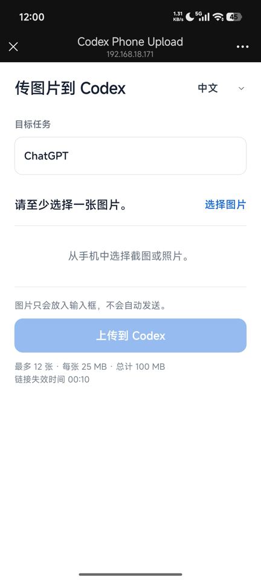
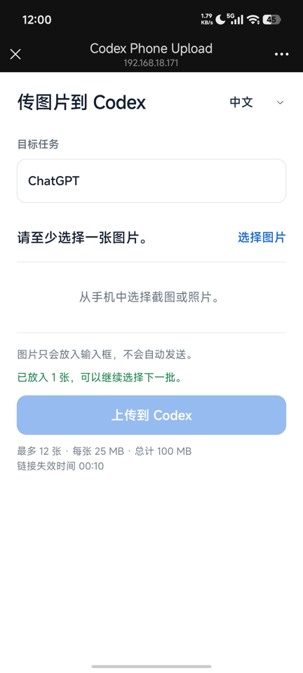
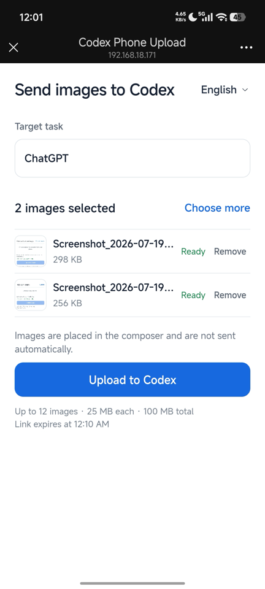

# Codex Phone Upload

Scan a QR code with WeChat and place phone screenshots or photos directly into the current Codex desktop composer.

It removes the usual detour through WeChat File Transfer, AirDrop, or saving images to the Mac desktop first. Open the app only when you need it, scan once, and keep sending image batches to the same Codex task for 10 minutes.

## Features

- Chinese and English interfaces, following the Mac or phone language by default
- A multi-image upload queue with thumbnails, file sizes, removal, and progress
- Multiple upload batches from the same QR-code page during its 10-minute session
- Up to 12 images per batch, 25 MB per image, and 100 MB total
- Locks the active Codex composer when the QR code is created
- If a batch stops partway through, retry only the remaining images
- Does not send the Codex message
- Does not inspect or analyze images
- Does not save images to the project directory

## How It Works

1. Open the target task in Codex.
2. Open **CodexPhoneUpload** and scan its QR code with WeChat.
3. Choose one or more screenshots or photos on the phone.
4. Review the queue, remove unwanted images, and upload.
5. The images appear in the Codex composer as unsent attachments.
6. Choose another batch from the same phone page, or return to Codex and add your instructions.

## Screenshots

These are real phone captures from a successful same-Wi-Fi session.

<table>
  <tr>
    <td align="center"></td>
    <td align="center"></td>
    <td align="center"></td>
  </tr>
  <tr>
    <td align="center"><strong>Choose images</strong><br>Chinese interface and target-task confirmation</td>
    <td align="center"><strong>Continue in batches</strong><br>The queue clears after a successful upload</td>
    <td align="center"><strong>Review before upload</strong><br>Thumbnails, sizes, removal, and English UI</td>
  </tr>
</table>

## Install in One Command

Requirements: macOS 14 or later, the Codex desktop app, and Xcode Command Line Tools.

Paste this command into Terminal:

```bash
/bin/bash -c "$(curl -fsSL https://raw.githubusercontent.com/dingaiminGIT/codex-phone-upload/main/install.sh)"
```

The installer automatically:

1. Downloads or updates the source at `~/.local/share/codex-phone-upload`.
2. Builds and installs `~/Applications/CodexPhoneUpload.app`.
3. Installs the `$phone-upload` Skill at `~/.codex/skills/phone-upload`.
4. Opens the macOS app when installation finishes.

No Homebrew package is required for same-Wi-Fi uploads. You can [review the installer](install.sh) before running it.

If Xcode Command Line Tools are missing, macOS will open its installer. Finish that installation, then run the same command again.

## First-Time Setup

The app needs Accessibility permission to focus the Codex composer and paste attachments.

1. Open **System Settings → Privacy & Security → Accessibility**.
2. Enable **CodexPhoneUpload**.
3. Close and reopen the app.
4. Restart Codex once so it discovers the installed Skill.

This permission is normally required only once. macOS may request it again after the app is rebuilt or upgraded.

If macOS asks whether the app may accept incoming network connections, click **Allow**. This lets the phone reach the temporary upload page over Wi-Fi.

## Everyday Use: Open the App

This is the simplest workflow.

1. Open Codex and select the task that should receive the images.
2. Keep that task and its composer visible.
3. Open **CodexPhoneUpload** from Spotlight or Applications.
4. Scan the QR code with WeChat.
5. Select up to 12 images on the phone and upload them.
6. Wait for the phone page to report success.
7. Return to Codex. The images are attached to the composer but are **not sent**.
8. Add your instructions and send the message manually when ready.

The same QR-code page accepts multiple batches until its 10-minute link expires. After each successful batch, the phone queue clears so you can choose more images. The app does not stay in the menu bar or start at login; close it when you finish.

The Mac app and phone page automatically use Simplified Chinese when the system or browser language starts with Chinese; otherwise they use English. Use the language menu to switch between **中文** and **English** manually.

Before uploading, the phone page shows each selected image, its file size, and a remove action. It rejects batches over 12 images, individual images over 25 MB, or a combined size over 100 MB before transfer begins.

## Alternative Use: Trigger the Skill in Codex

The one-command installer also installs the Skill. In the target Codex task, enter:

```text
$phone-upload Generate a QR code and place images from my phone into the current composer. Do not send or analyze them.
```

Codex displays a QR code and a fallback link. Scan the code, select the images, upload them, and wait for the success message. The images appear as unsent composer attachments.

## Same-Wi-Fi and Remote Modes

The macOS app and the Skill use direct same-Wi-Fi transfer by default. This is the fastest and most reliable option, and images do not pass through a third-party server.

Local mode uses unencrypted HTTP, so use it only on a trusted home or office Wi-Fi network. On hotel, cafe, guest, or other shared networks, use a personal hotspot or explicitly choose the Skill's remote mode, which uses an HTTPS Cloudflare tunnel.

Only the Skill supports optional remote mode. Install `cloudflared` first:

```bash
brew install cloudflared
```

Then enter:

```text
$phone-upload Use remote mode. Generate a QR code and place images from my phone into the current composer. Do not send or analyze them.
```

Remote mode creates a temporary Cloudflare tunnel and can be slower or less reliable than same-Wi-Fi mode.

## Update

Run the same installation command again:

```bash
/bin/bash -c "$(curl -fsSL https://raw.githubusercontent.com/dingaiminGIT/codex-phone-upload/main/install.sh)"
```

The installer pulls the latest source, rebuilds the app, and refreshes the Skill link. Restart Codex if the Skill changed. A rebuilt app may need Accessibility permission again.

## Troubleshooting

### The phone cannot open the QR-code page

- Confirm that the phone and Mac are on the same Wi-Fi network.
- Temporarily disable VPNs on the phone and Mac.
- Avoid guest Wi-Fi networks that isolate connected devices.
- Allow incoming connections in the macOS firewall prompt.
- Reopen the app if the QR code is more than 10 minutes old.

### The phone reports success, but Codex has no attachment

- Keep the intended Codex task open and its composer visible.
- Confirm that **CodexPhoneUpload** is enabled under **System Settings → Privacy & Security → Accessibility**.
- Run the one-command installer again to update the app.
- Reopen the app and retry with a new QR code.

### Codex does not recognize `$phone-upload`

Confirm the installed link:

```bash
ls -ld ~/.codex/skills/phone-upload
```

Then restart Codex. The macOS app can still be used independently of the Skill.

### The Accessibility prompt appears again

This can happen after rebuilding, replacing, moving, or upgrading the app. Enable the current app again in **System Settings → Privacy & Security → Accessibility**.

## Manual Installation

Use these steps only if you do not want to run the one-command installer.

```bash
git clone https://github.com/dingaiminGIT/codex-phone-upload.git
cd codex-phone-upload

# Build and install the app
cd menubar
./script/build_and_run.sh --install
cd ..

# Install the Skill
mkdir -p ~/.codex/skills
ln -s "$(pwd)/skills/phone-upload" ~/.codex/skills/phone-upload
```

Restart Codex after installing the Skill.

## Uninstall

```bash
rm -rf ~/Applications/CodexPhoneUpload.app
rm ~/.codex/skills/phone-upload
rm -rf ~/.local/share/codex-phone-upload
rm -rf ~/Library/Application\ Support/CodexPhoneUpload
```

## Contributors

- [@dingaiminGIT](https://github.com/dingaiminGIT) — creator and maintainer
- [@codex](https://github.com/codex) — AI coding collaborator

## Privacy and Security

- Upload URLs contain a high-entropy random token and never use a fixed endpoint.
- Same-Wi-Fi mode uses unencrypted HTTP and is intended only for trusted local networks; remote mode uses an HTTPS Cloudflare tunnel.
- Local app sessions expire after 10 minutes and can accept multiple batches during that window. Skill sessions still stop after one successful batch.
- The app locks the active Codex composer when it creates the QR code instead of silently choosing a different task later.
- The Skill accepts temporary images only inside its dedicated system staging root, deletes each batch after pasting, and rejects cleanup paths outside that root. The app keeps uploads in memory.
- Skill session metadata, QR codes, and logs are stored under the current user's private `~/Library/Application Support/CodexPhoneUpload` directory, not inside the project.
- Before stopping a Skill server, the tool verifies the process command, state-file path, and per-session random identifier instead of trusting a saved PID alone.
- Uploaded images are never written to the current project.
- The tool uses the macOS Accessibility API only to focus the Codex composer and paste attachments.
- The tool does not send the Codex message and does not analyze uploaded images.

## Development

Run the Python lifecycle tests, parser self-tests, and verify the app build:

```bash
python3 -m unittest discover -s skills/phone-upload/tests -v
cd menubar
swift run --jobs 1 CodexPhoneUploadSelfTests
./script/build_and_run.sh --verify
```

Rebuild the universal Apple Silicon and Intel helper after changing `paste_files.swift`:

```bash
./skills/phone-upload/scripts/build_helper.sh
```

For mobile layout checks, append `?preview=queue` to an active upload URL. This shows a disabled six-image fixture and never uploads it.

Repository layout:

```text
.codex-plugin/          Codex plugin metadata
skills/phone-upload/    Codex Skill plus Python and Swift helpers
menubar/                SwiftUI macOS app
install.sh              One-command installer for the app and Skill
```

Licensed under the MIT License.
