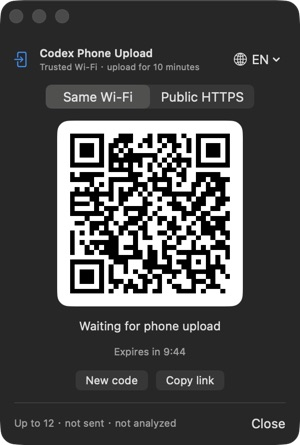

# Codex 手机传图

[English](README.md) | [简体中文](README.zh-CN.md)

用微信扫描二维码，把手机截图或照片直接放入当前 Codex 桌面端对话的输入框。

它省去了“微信文件传输助手 / AirDrop → 保存到电脑 → 再拖进 Codex”的中转步骤。需要时打开应用，扫码一次，即可在 10 分钟内向同一个 Codex 任务连续上传多批图片。

## 功能特点

- 中文、英文双语界面，默认跟随 Mac 或手机语言
- 多图队列：缩略图、文件大小、移除和上传进度
- 同一个二维码在 10 分钟会话内支持连续多批上传
- 默认同一 Wi-Fi 直传；公司或访客网络隔离设备时，可明确切换为公网 HTTPS
- 每批最多 12 张、单张最多 25 MB、总计最多 100 MB
- 生成二维码时锁定当前 Codex 输入框，避免传到其他任务
- 设置或粘贴失败时，可复制一份不含隐私内容的兼容性诊断
- 批量粘贴中途失败时，只重试尚未成功的图片
- 只把图片放入输入框，不自动发送消息
- 不查看、不分析图片内容
- 不把图片保存到当前项目目录
- 使用免费的本机稳定签名，让辅助功能权限能够跨本机更新和重新构建继续匹配

## 工作流程

1. 在 Codex 中打开目标任务。
2. 打开 **CodexPhoneUpload**，使用微信扫描二维码。
3. 在手机中选择一张或多张截图、照片。
4. 预览队列、删除误选图片，然后上传。
5. 图片作为未发送附件出现在 Codex 输入框中。
6. 可以继续选择下一批，也可以回到 Codex 补充文字后手动发送。

## 效果图

### Mac 应用

应用窗口保持紧凑，并支持中文和英文。下图使用不可上传的 `example.com` 演示二维码，不包含真实上传地址、局域网 IP、会话令牌、任务名称或电脑信息。

<table>
  <tr>
    <td align="center"></td>
    <td align="center"></td>
  </tr>
  <tr>
    <td align="center"><strong>中文 Mac 界面</strong><br>紧凑二维码窗口，可切换局域网和公网模式</td>
    <td align="center"><strong>英文 Mac 界面</strong><br>相同流程的英文版本</td>
  </tr>
</table>

### 手机上传页

以下图片来自一次真实的同 Wi-Fi 上传会话。

<table>
  <tr>
    <td align="center"></td>
    <td align="center"></td>
    <td align="center"></td>
  </tr>
  <tr>
    <td align="center"><strong>选择图片</strong><br>中文界面并确认目标任务</td>
    <td align="center"><strong>连续上传</strong><br>成功后清空队列，可选择下一批</td>
    <td align="center"><strong>上传前检查</strong><br>缩略图、大小、移除和英文界面</td>
  </tr>
</table>

## 一条命令安装

要求：macOS 14 或更高版本、Codex 桌面应用和 Xcode Command Line Tools。

把下面命令粘贴到终端：

```bash
/bin/bash -c "$(curl -fsSL https://raw.githubusercontent.com/dingaiminGIT/codex-phone-upload/main/install.sh)"
```

安装程序会自动：

1. 下载或更新源码到 `~/.local/share/codex-phone-upload`。
2. 构建并安装 `~/Applications/CodexPhoneUpload.app`。
3. 把 `$phone-upload` Skill 安装到 `~/.codex/skills/phone-upload`。
4. 已有 `cloudflared` 时直接复用；有 Homebrew 时自动安装，用于可选的公网 HTTPS 模式。
5. 询问是否创建或复用登录钥匙串中的免费本机签名身份。
6. 安装结束后打开 Mac 应用。

同 Wi-Fi 上传不依赖 Homebrew。如果没有 Homebrew，安装程序会跳过 `cloudflared`，局域网模式仍可正常使用。执行前也可以先[检查安装脚本](install.sh)。

如果缺少 Xcode Command Line Tools，macOS 会打开安装窗口。完成安装后，再执行一次同样的命令。

## 首次设置

应用需要“辅助功能”权限，才能聚焦 Codex 输入框并粘贴图片附件。首次安装时，请接受“本机稳定签名”选项。当 macOS 提示 **codesign** 想访问 `signing-identity` 密钥时，输入 Mac 登录密码并选择 **始终允许**。如果弹窗显示的是其他应用或其他密钥，请不要授权。

随后：

1. 打开 **系统设置 → 隐私与安全性 → 辅助功能**。
2. 启用 **CodexPhoneUpload**。
3. 关闭并重新打开应用。
4. 重启一次 Codex，让它发现已安装的 Skill。

这个权限通常只需设置一次。0.4.3 版本首次引入稳定本机签名，因此从旧的临时签名版本升级时，需要删除旧的辅助功能条目，添加新签名的应用，并最后启用一次。只要证书仍保留在登录钥匙串中、应用路径不变，后续升级会复用同一身份。

该证书是只属于这台 Mac 的自签名证书，用途标记为代码签名，私钥不可导出。它不会加入系统信任，不会绕过 Gatekeeper，也不能让其他 Mac 信任 GitHub 下载的应用。

如果 macOS 询问是否允许应用接受传入网络连接，请选择**允许**，手机才能通过 Wi-Fi 访问临时上传页。

## 日常使用：打开应用

1. 打开 Codex，并选中要接收图片的任务。
2. 保持该任务及其输入框可见。
3. 从 Spotlight 或“应用程序”中打开 **CodexPhoneUpload**。
4. 默认使用**同一 Wi-Fi**；如果网络隔离设备，主动切换到**公网 HTTPS**。
5. 使用微信扫描二维码。
6. 在手机端选择最多 12 张图片并上传。
7. 等待手机页面显示上传成功。
8. 回到 Codex，图片已经进入输入框，但**不会自动发送**。
9. 补充说明，并在确认后手动发送。

同一个二维码页面可以连续上传多批，直到 10 分钟链接过期。每批成功后，手机队列会自动清空，方便继续选择。应用不会常驻菜单栏，也不会开机启动；用完直接关闭即可。

Mac 应用和手机页面在系统或浏览器语言以中文开头时默认显示简体中文，否则显示英文，也可以从语言菜单手动切换。

上传前，手机页面会显示每张图片、文件大小和移除操作。超过 12 张、单张超过 25 MB 或总大小超过 100 MB 时，会在传输前拒绝该批次。

## 另一种入口：在 Codex 中触发 Skill

一条命令安装程序也会安装 Skill。在目标 Codex 任务中输入：

```text
$phone-upload 生成二维码，把手机图片放进当前输入框，不要发送，也不要分析。
```

Codex 会显示二维码和备用链接。扫码、选择并上传后，图片会作为未发送附件进入输入框。

## 同 Wi-Fi 与公网模式

Mac 应用和 Skill 默认都采用同 Wi-Fi 直传。这是速度最快的方式，图片不会经过第三方网络。

局域网模式使用未加密 HTTP，因此只应在可信的家庭或办公 Wi-Fi 中使用。在公司、酒店、咖啡馆、访客网络等可能隔离设备的环境中，请使用个人热点，或在应用中明确选择**公网 HTTPS**。切换模式会先关闭旧会话，再生成新二维码。

公网模式需要 Cloudflare 的 `cloudflared` 连接器。安装程序会在可用时通过 Homebrew 自动安装，也可以手动安装：

```bash
brew install cloudflared
```

在应用中选择**公网 HTTPS**。使用 Skill 时输入：

```text
$phone-upload 使用远程模式生成二维码，把手机图片放进当前输入框，不要发送，也不要分析。
```

公网模式无需 Cloudflare 账号，会生成随机的临时 `trycloudflare.com` HTTPS 地址。流量会经过 Cloudflare 转发到 Mac 本地上传服务，因此请勿分享二维码和链接。会话结束或切换模式时，隧道会停止；公司网络策略也可能让它变慢或不可用。

## 更新

再次执行同一条安装命令：

```bash
/bin/bash -c "$(curl -fsSL https://raw.githubusercontent.com/dingaiminGIT/codex-phone-upload/main/install.sh)"
```

安装程序会拉取最新源码、重新构建应用、复用同一本机签名身份，并刷新 Skill 链接。如果 Skill 有变化，请重启 Codex。0.4.3 或更高版本获得辅助功能权限后，普通更新不应再要求删除并重新添加应用。

## 排障

### 手机打不开二维码页面

- 确认手机和 Mac 连接同一个 Wi-Fi。
- 临时关闭手机和 Mac 上的 VPN。
- 避免使用会隔离设备的访客 Wi-Fi。
- 在 macOS 防火墙提示中允许传入连接。
- 二维码超过 10 分钟时重新打开应用。
- 如果 Mac 能打开链接，但手机提示 `ERR_ADDRESS_UNREACHABLE`，请选择**公网 HTTPS**或使用个人热点。

### 手机显示成功，但 Codex 输入框没有图片

- 保持目标 Codex 任务和输入框可见。
- 确认 **系统设置 → 隐私与安全性 → 辅助功能** 中已启用 **CodexPhoneUpload**。
- 再运行一次安装命令，更新到最新版。
- 重新打开应用并生成新二维码重试。

如果应用报告失败，请选择**复制诊断信息**，并把报告附在 GitHub Issue 中。报告只在本地生成，不会自动上传；它包含应用、macOS、Codex 版本以及辅助功能节点数量和失败阶段，不包含对话文字、图片、文件名、上传地址或会话令牌。

### Codex 无法识别 `$phone-upload`

检查 Skill 链接：

```bash
ls -ld ~/.codex/skills/phone-upload
```

然后重启 Codex。即使不使用 Skill，Mac 应用仍可独立使用。

### 辅助功能权限反复出现

检查稳定本机签名是否存在：

```bash
~/.local/share/codex-phone-upload/menubar/script/local_signing.sh status
```

如果这是从 0.4.3 之前版本的首次升级，请在**系统设置 → 隐私与安全性 → 辅助功能**中删除旧的 **CodexPhoneUpload**，添加 `~/Applications/CodexPhoneUpload.app`，再启用一次。如果命令显示 `missing`，重新执行一条命令安装，并接受本机签名。移动应用、删除签名身份，或者安装另一台 Mac 签名的构建，都会形成新身份，需要重新授权。

## 手动安装

不想使用一条命令安装时，可以手动执行：

```bash
git clone https://github.com/dingaiminGIT/codex-phone-upload.git
cd codex-phone-upload

# 构建并安装应用
cd menubar
./script/local_signing.sh ensure
./script/build_and_run.sh --install
cd ..

# 安装 Skill
mkdir -p ~/.codex/skills
ln -s "$(pwd)/skills/phone-upload" ~/.codex/skills/phone-upload
```

安装 Skill 后重启 Codex。

## 卸载

```bash
rm -rf ~/Applications/CodexPhoneUpload.app
rm ~/.codex/skills/phone-upload
rm -rf ~/.local/share/codex-phone-upload
rm -rf ~/Library/Application\ Support/CodexPhoneUpload
```

默认保留本机签名身份，方便以后重新安装时继续使用相同的辅助功能身份。如需同时删除：

```bash
security delete-identity -c "Codex Phone Upload Local Signing" "$HOME/Library/Keychains/login.keychain-db"
```

## 贡献者

- [@dingaiminGIT](https://github.com/dingaiminGIT) — 创建者和维护者
- [@codex](https://github.com/codex) — AI 编程协作者

## 隐私与安全

- 上传 URL 包含高强度随机令牌，不使用固定裸接口。
- 同 Wi-Fi 模式使用未加密 HTTP，只适合可信局域网；公网模式使用 Cloudflare HTTPS 隧道。
- Mac 应用会话 10 分钟后过期，其间支持多批上传；Skill 会话成功上传一批后即结束。
- 应用生成二维码时会锁定当前 Codex 输入框，不会稍后悄悄选择另一个任务。
- Skill 只在专用系统临时根目录中接收图片，粘贴后删除每个批次，并拒绝清理根目录之外的路径；Mac 应用则只在内存中保存上传内容。
- Skill 的会话元数据、二维码和日志保存在当前用户私有的 `~/Library/Application Support/CodexPhoneUpload` 中，不进入项目目录。
- Skill 停止服务器前会核对进程命令、状态文件路径和每次会话随机标识，不只信任保存的 PID。
- 上传图片不会写入当前项目。
- 工具只使用 macOS 辅助功能 API 聚焦 Codex 输入框并粘贴附件。
- 可选的本机签名证书是未受系统信任的自签名证书，保存在登录钥匙串中，私钥不可导出，仅用于保持这台 Mac 上应用的身份在重新构建后稳定。
- 工具不会发送 Codex 消息，也不会分析上传图片。

## 开发

运行 Python 生命周期测试、解析器自测并验证 Mac 应用构建：

```bash
python3 -m unittest discover -s skills/phone-upload/tests -v
cd menubar
swift run --jobs 1 CodexPhoneUploadSelfTests
./script/build_and_run.sh --verify
```

修改 `paste_files.swift` 后，重新构建 Apple Silicon 和 Intel 通用辅助程序：

```bash
./skills/phone-upload/scripts/build_helper.sh
```

检查手机布局时，可在有效上传 URL 后添加 `?preview=queue`。它只显示一个禁用上传的六图测试队列，不会真正上传。

目录结构：

```text
.codex-plugin/          Codex 插件元数据
skills/phone-upload/    Codex Skill、Python 与 Swift 辅助程序
menubar/                SwiftUI macOS 应用
install.sh              应用与 Skill 的一条命令安装脚本
```

本项目采用 MIT License。
